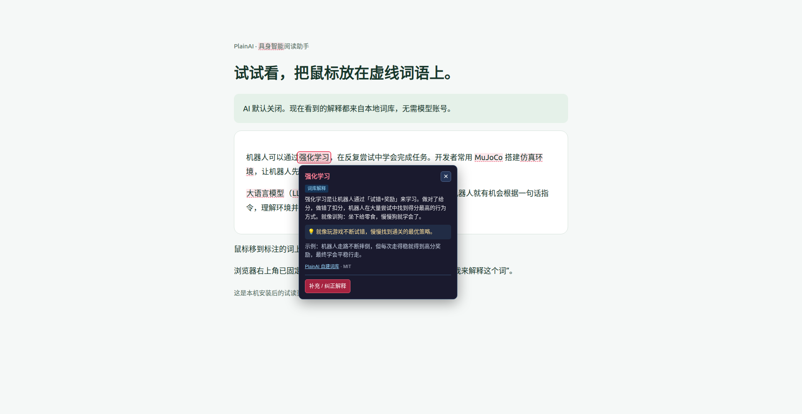

# 降维翻译器 PlainAI

**把高密度行业术语翻译成人话的浏览器扩展。**

浏览具身智能/机器人/AI 领域文章时，自动标注专业术语，鼠标悬停即显示大白话解释——不用反复搜索、反复揣摩就能读懂行业话术。

## 功能

- **自动标注**：页面加载后自动扫描全文，把术语标成红色虚线底纹，一眼看出哪些是行业黑话
- **悬停即释**：鼠标移上术语弹出解释（平均 31 字精简说明 + 生活类比），300ms 缓冲，可移过去点击链接
- **三层识别**：
  1. 词库精确匹配（3093 条术语 + 别名）
  2. 疑似术语识别（英文大写缩写如 `RT-2`、`GR00T`，自动高亮）
  3. AI 兜底（词库没收录的词，调用你自己的大模型实时解释）
- **常见词过滤**：`CEO`、`USB`、`CPU` 等 100+ 个通用缩写不标注，避免噪音
- **社区入口**：提示框底部可挂载社群链接，用于私域引流

## 安装

### 本地安装示例：Linux + Chrome（本机开发版）

下面是一次实际安装记录：2026-10-03，在 Linux 的 Google Chrome 150 中安装 PlainAI **0.4.0 本机开发版（完整词库 3,093 条）**，并验证本地解释可用。

> **版本说明：** 本例来自已经在本机验证的开发构建，尚未作为 GitHub Release 或商店版本发布；截图中的 AI 开关、贡献入口等属于该开发版，不代表当前远端源码已包含这些功能。请以拿到的实际安装包为准。完整词库中的 embodiedterms.com 数据采用 CC BY-NC 4.0，仅限非商业使用。

**准备好已构建的扩展文件夹。** 本例把构建产物复制到固定目录 `~/Downloads/aihot/plainai-installed`，文件夹内直接包含 `manifest.json`、`popup.html`、`dict.json` 等文件。你可以换成自己的目录，不必使用相同路径。若拿到 ZIP，先解压；GitHub 的 **Code → Download ZIP 是源码包**，需要按下方开发者步骤构建，不能直接当作扩展安装包加载。

1. **打开扩展管理页。** 在 Chrome 地址栏输入 `chrome://extensions`，按回车。Edge 的对应入口是 `edge://extensions`，但本次实际验证使用的是 Chrome。
2. **打开“开发者模式”。** 点击“加载未打包的扩展程序”（有些版本叫“加载已解压的扩展程序”），选择上面直接含有 `manifest.json` 的文件夹。本例选择 `plainai-installed`，不要选它的上一级目录，也不要选 ZIP 文件本身。
3. **确认安装成功。** 扩展列表应出现“降维翻译器 PlainAI”，版本为 `0.4.0`，开关处于启用状态。首次安装会自动打开入门页。
4. **固定入口，保持 AI 关闭。** 点击拼图图标，把 PlainAI 固定到工具栏；也可在扩展“详情”中打开“固定到工具栏”。点击 PlainAI 图标，确认“启用术语解释”和“每个术语只标注首次出现”已勾选、“AI 翻译”未勾选。无需填写模型或 API Key。
5. **打开文章试读。** 刷新已打开的普通网页，把鼠标移到有虚线的术语上，查看解释，按 Esc 收起。本例用包含“强化学习”“MuJoCo”“仿真环境”“大语言模型”等词的本地试读页，确认标注和解释实际出现。

本例的实际验收结果：

| 检查项 | 结果 |
| --- | --- |
| 扩展状态 | 已启用，已固定到 Chrome 工具栏 |
| AI 翻译 | 默认关闭，只使用本地词库 |
| 本地词库 | 3,093 条；同一术语及其别名只标一次 |
| 减少打扰 | 首页可禁用/恢复当前站点；关闭术语解释立即清除标注和提示框，无需刷新 |
| 解释效果 | “强化学习”显示大白话解释、类比、示例和 MIT 来源 |
| 运行状态 | Chrome 扩展详情中没有运行错误 |
| 共享投稿 | 入口已提供；本例未配置共享服务，尚不能公开发布 |



*上图来自已安装的真实 Chrome 扩展，不是界面设计图；截图时 AI 处于关闭状态。*

**遇到问题时：**

- 提示“清单文件缺失或不可读取”：检查所选文件夹里是否直接有 `manifest.json`。Linux 的文件选择框中粘贴完整路径后，要先按回车确认路径，避免仍选中“最近使用”的其他文件夹。
- 安装成功但没有标注：先刷新文章页，确认术语解释已启用、站点未被禁用，且文章包含词库已有的词。浏览器设置页、扩展商店等受保护页面无法标注。
- 想用本地 HTML 试读：在扩展详情中确认“允许访问文件网址”已开启；只读普通网站无需开启此项。

**安装后保留这个文件夹，不要删除或移动。** 更新时将新版本文件放回同一目录，在扩展管理页点击 PlainAI 的“重新加载”，再刷新文章；日常使用不需要重复安装，也不需要运行命令行。

### 从源码构建

```bash
npm install
npm run build          # 输出到 .output/chrome-mv3/
```

然后在 Chrome 打开 `chrome://extensions`：

1. 开启右上角「开发者模式」
2. 点「加载已解压的扩展程序」
3. 选择 `.output/chrome-mv3` 目录

### 配置 AI 兜底（可选）

不配置也能用（词库部分工作正常）。配好后，词库没收录的术语也能实时解释。

点击扩展图标 → 填写：

| 配置项 | 说明 | 示例 |
|:------|:----|:----|
| 服务器地址 | OpenAI 兼容的 chat completions 接口 | `http://localhost:8000/v1/chat/completions` |
| 模型名称 | 模型标识 | `qwen2.5-7b-instruct` |
| API Key | 可选，本地模型一般不需要 | — |

支持任何 OpenAI 兼容接口：vLLM、Ollama、LM Studio、DeepSeek、通义千问等。

## 词库

### 数据来源

词库由两部分合并（自建词条优先）：

| 来源 | 条数 | 许可 |
|:----|:----|:----|
| 本项目自建 | 248 | MIT |
| [embodiedterms.com](https://embodiedterms.com) | 2845 | **CC BY-NC 4.0** |

**术语解释数据来自 [embodiedterms.com](https://embodiedterms.com)（CC BY-NC 4.0）**，
该数据**不可用于商业用途**。详见 [LICENSE-CONTENT.md](LICENSE-CONTENT.md)。

### 词库文件

- `lib/dictionary/terms*.ts` — 自建词条（可直接编辑）
- `lib/dictionary/terms-embodiedterms.ts` — 生成文件，勿手改
- `public/dict.json` — 构建产物，扩展运行时按需加载（762 KB）

词库以 JSON 形式按需加载，不打进 content script，因此：

- `content.js` 仅 12 KB（不是 780 KB）
- 词库解析耗时约 10 ms

### 重新生成词库

```bash
# 需要 embodiedterms 数据源（见下方说明）
python -X utf8 scripts/build_dict.py     # 生成 TS 词库
npm run dict                              # 导出 public/dict.json
```

原始数据获取方式：访问 [embodiedterms.com](https://embodiedterms.com)，
其数据文件为 `/data/zh.<hash>.json`（见网站源码引用），下载后放到项目根目录
命名为 `embodiedterms_zh.json`。

### 添加自己的词条

编辑 `lib/dictionary/terms.ts`（或新建文件并在 `lookup.ts` 中引入）：

```ts
{
  term: '你的术语',
  category: 'embodied-ai',        // embodied-ai | robotics | aiml | general
  plain: '一句话大白话解释（30 字左右）',
  example: '使用场景（可选）',
  analogy: '生活类比（可选）',
  aka: ['别名1', 'English Name'],  // 可选，用于扩大匹配范围
}
```

## 开发

```bash
npm run dev            # 开发模式（热重载）
npm run build          # 生产构建
npm run compile        # TypeScript 类型检查
node scripts/verify.cjs  # 词库与构建产物验证
```

### 项目结构

```
entrypoints/
  content.tsx          内容脚本：扫描标注 + tooltip + AI 兜底
  background.ts        后台：设置页消息处理
  popup/              设置页（React）
lib/
  dictionary/         词库（自建 + 生成的 embodiedterms 词条）
  utils/ai.ts         AI 配置与调用
scripts/
  build_dict.py       生成 TS 词库
  export-dict.cjs     导出 public/dict.json
  verify.cjs          验证脚本
public/
  dict.json           词库构建产物
```

### 技术栈

- [WXT](https://wxt.dev/) — 浏览器扩展框架
- TypeScript + React（仅设置页）
- 内容脚本使用原生 DOM（体积小、性能好）

### 用 AI 助手修改本项目

本项目自带 [`AGENTS.md`](AGENTS.md)（AI 助手项目说明书，说明目录结构、构建链路、
三层识别机制、许可边界与常见坑）。支持该约定的工具会自动读取它。

**方式一：本地 Coding Agent**（Claude Code / Cursor / Codex / Reasonix 等，能直接改文件）

```bash
git clone https://github.com/chenyimu691-gif/plainai.git
cd plainai
npm install
```

用 AI 工具打开该目录，直接提需求（如"把 tooltip 的主题色改成深蓝"）即可。

**方式二：网页版对话 AI**（ChatGPT / DeepSeek / 豆包等，不能直接改文件）

把 [`AGENTS.md`](AGENTS.md) 连同要改的文件内容一起贴给它，让它输出修改后的代码，
再自行替换。

**方式三：GitHub Copilot**

仓库已包含 [`.github/copilot-instructions.md`](.github/copilot-instructions.md)，
Copilot 在对话与补全时会自动参考。

## 隐私

- 词库在本扩展内本地运行，不联网
- 只有遇到词库未收录的术语时，才把该**术语本身**发送到你配置的 AI 接口
- 不收集任何浏览记录、不发送页面内容

## 许可

- **源代码**：[MIT](LICENSE)
- **词库数据**：自建部分 MIT；embodiedterms 部分
  [CC BY-NC 4.0](https://creativecommons.org/licenses/by-nc/4.0/deed.zh-hans)
  （署名 · 非商业性使用）

如果你要商业使用，请移除 `lib/dictionary/terms-embodiedterms.ts` 并重新生成词库。

## 致谢

- 术语数据：[embodiedterms.com](https://embodiedterms.com) —《具身智能新手名词表》

## 联系方式

- **邮箱**：chenyimu691@gmail.com
- **微信**：15303638650

欢迎反馈使用问题、提交词条建议，或交流具身智能/机器人相关话题。
